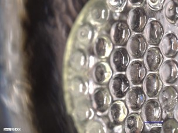

# Portfolio site

Static HTML and CSS. No build step, no dependencies. Open `index.html` in a
browser to preview locally.

## Putting it online

1. Make a repo named `nadezhda890.github.io` (substitute your GitHub username).
2. Push everything in this folder to the `main` branch, keeping the structure.
3. In the repo, go to Settings → Pages, and set the source to `main` / root.
4. The site appears at `https://<username>.github.io` within a minute or two.

For any other repo name, the URL is `https://<username>.github.io/<repo-name>/`.

## Adding images

Every placeholder box on the site shows the exact filename it expects. Drop the
file into `images/` with that name, then in the HTML replace the placeholder
block with an ``:

```html
<!-- replace this -->
<div class="ph">
  <div class="ph-file">images/map-array-micrograph.jpg</div>
  <div class="ph-note">...</div>
</div>

<!-- with this -->

```

Write a real `alt` description each time — it matters for accessibility and for
anyone whose images don't load.

Resize photos to about 1600 px on the long edge before uploading. Straight from a
phone they're 4–8 MB each and the site will crawl.

## Image checklist

**MAP phototherapy patch** (`map-phototherapy.html`)
- [ ] `map-array-micrograph.jpg` — microneedle-microlens array under a microscope, with a scale bar if possible
- [ ] `map-cad-exploded.png` — SOLIDWORKS render of the device stack
- [ ] `map-comsol-thermal.png` — COMSOL thermal model, ideally before/after
- [ ] `map-fabrication.jpg` — cleanroom process step or a batch of finished devices
- [ ] `map-invitro-results.png` — a results figure from the published paper
- [ ] `map-poster.jpg` — the IEEE MEMS poster

**Brain slice chamber** (`brain-slice-chamber.html`)
- [ ] `chamber-cad.png` — CAD render showing the flow path
- [ ] `chamber-fabricated.jpg` — the machined chamber
- [ ] `chamber-setup.jpg` — chamber installed in the rig
- [ ] `chamber-slice.jpg` — tissue in the chamber (optional)

**Blood pressure system** (`blood-pressure-system.html`)
- [ ] `bp-system-overview.jpg` — assembled system, or a block diagram
- [ ] `bp-cuff-cad.png` — cuff CAD
- [ ] `bp-pump.jpg` — peristaltic pump
- [ ] `bp-clinician-app.png` — app screenshot
- [ ] `bp-testing.jpg` — validation session or a measurement comparison plot

**EOG wearable** (`eog-wearable.html`)
- [ ] `eog-device.jpg` — the wearable
- [ ] `eog-app.png` — app screenshot
- [ ] `eog-signal.png` — EOG trace with blinks marked

**Workshops** (`hardware-workshops.html`)
- [ ] `workshop-room.jpg` — wide shot of a full room
- [ ] `workshop-optical-circuit.jpg` — breadboarded Argon sender and receiver
- [ ] `workshop-students-building.jpg` — students working in pairs
- [ ] `workshop-audio-build.jpg` — ESP32 with I²S mic and amplifier
- [ ] `workshop-prints.jpg` — printed parts from the CAD track

Also: drop your résumé in as `resume.pdf` — the footer already links to it.

## Before you publish

- **Clear unpublished work with Dr. Kim.** The MAP paper is published, so its
  figures are fine. The microfluidics chamber is not, and neither is the MAP
  in vivo work. Device geometry, process detail, and unpublished results can
  affect a future paper or filing. If he says no, keep the page and drop the
  images — the text alone still works.
- **Get consent for any photo with a recognisable face**, including workshop
  attendees and anyone in a testing photo.
- **No in vivo animal photos.** They add nothing for a hardware reviewer.
- **Your phone number is not on the site,** deliberately. Email and LinkedIn
  are enough for a public page.
